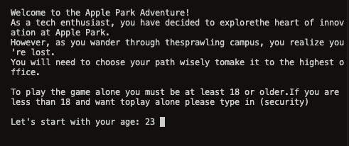
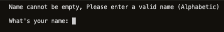
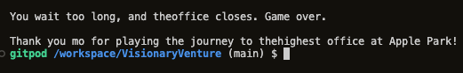

# Testing The Apple Park Adventure

In this section, we aim to demonstrate that comprehensive testing has been conducted on the project to ensure it functions as expected and provides a smooth user experience. Each feature of the project has been meticulously tested to validate its proper functioning, ensuring that the user can achieve their goals without any hindrance. The focus is on presenting a well-structured testing process, covering various scenarios and outcomes to prove the reliability and usability of the project.

## Testing Step by Step

Testing if the game goes step by step and shows the right content every step. 

    The following sections detail the tests performed on "The Apple Park Adventure" game, including functional checks, error handling, and compliance with coding standards. Each test case describes the steps taken, the expected outcomes, and any issues encountered along the way, along with their resolutions. This thorough testing ensures that the game behaves as intended and provides a seamless experience for the users.

##### Testing 1

- Testing introduction text, age and name and they working as they should. 
  - When user enter age older than 18 or have security clearence from the Security House, then the user can go to the next step where user must type in only name (alphabetic) then he/she can start the adventure. Otherwise user can't go to the next step, it'll be loop asking same question only: if user don't have security clearence, younger then 18 or types alphabetic in age input or number in name input or empty in name input. The introductions and information of the adventure works also as they should, the text prints out 0.25 seconds after one another.
  - User will be informed that he/she must enter valid name, age, security clearence from the Security House or that the name input can't be empty.
- Here is screenshots of the testing name and age:

   

- When I tested the functions call, I get help with my mentor. And my mentor told me that I invoked all the functions three times and to fix this I use while loop and break the condition if the user chooses right option and call the next function inside the while loop scope, otherwise call the game over function so the game exits and tells the user that he/she loose the game.
- I had also unstyled text and the output informations and input choices made the screen hard to read and find the right text so I fix this to add time between print outputs and clear function (Added time and os modules.) To use time when printing out informations and clear the informations before the user types in one of the options.
- The game over conditions works like string and to fix this I added exit method in the game over function.
- When it comes calling the functions I called them once from the functions and the main function.

 ##### Testing 2

This is direct path to win the Apple Park Adventure. User have one of the options to choose and if the user chhose right one it goes the direct path until the exit options, and user can choose which he/she want to exit and no matter which one it prints out the one that the user chooses and calls the game over function. If user chooses the wrong one it can go to the another path that can be end to the win path or the loose path. If user enters something else it informs to choose only one of these two options. 

- Direct win path
  - Age: 24
  - Name: Daiel
  - choice 1: explore
  - choice 2: head
  - choice 3: side
  - choice 4: executive
  - choice 5: top
  - choice 6: enter
  - choice 7: ask
  - exit option
- Result = no error

The Testing 2 screenshots:

 ##### Testing 3 

- Direct game over path
  - Age: security
  - Name: Alex
  - choice 1: head
  - choice 2: lobby
  - choice 3: executive
  - choice 4: design
  - game over
- Result = no error

The Testing 3 screenshots:

##### Testing 4 

- Fast game over path
  - Age: 40
  - Name: Linda
  - choice 1: explore
  - choice 1: stay
  - game over
- Result = 1 error

Second question error in adventure_choices function

The Solution:

I solved the issue to first break the condition, inform the user that there are only two options and choose one of them next time to go to the next step of the adventure. I also tell them that the adventure game starts from the first question.

The Testing 4 screenshots:

##### Testing 5

- Testing the output informations, clear function, game over function and main function.
  - They are working as they should.
  - Time.sleep method also working.
  - The exit function works also.
- As you can see in these screenshots, the clear function cleans up the screen always, game over works, because it ends the adventure if the user choose invalid option and main function calls functions inside it.
- Result = no error

##### Testing on pep8 

- These are (Total 86 errors) the errors I solved when I did test the source code on pep8

- No space between hashtag and importing modules
- Line too long and expected 2 blank lines, found 1
- Whitespaces, trailing whitespace and over-indented
- Blank lines contains whitespaces and block comment should start with '# 
- Blank line at end of file

## Defensive Programming

- Users must enter valid age, name and one of the options
- Name input cannot be empty

First introduction of the app, then If the user input security clearence and age older than 18 it goes to the next step where the program asks to input name. 

  
  
Invalid inputs in name and age:

 
  
If user input is valid it goes to the first question and asks to either expolore or head to the main building. And also welcoming to the adventure and while callin the user name. 

 

If The user choice is Explore:

Now if the user chooses Stay the game over function will be called and the game ends. But if the user chooses head it goes continue to the base while loop condition. 

If The user choice is Head:

Both options is the right one's if the user chooses lobby or side it goes to the win path where it called in the program the executive corridor:

Now If the users chooses labs: 

But if the users choose executive:

If the users choose design:

Otherwise if their choice is top:

Now if the user choice is wait:

Or their choice is enter:

Now if the user choice is leave:

If the user choice is ask, he/she wins the adventure and next step will be to choose which one of the exit options you want go out frm the Apple Park.

The Winner way outs: 

 - If the user chooses 1 it prints out: you exit through the main gate and then the program calls the game over function.

 

 - If the user chooses 2 it prints out: you leave by the side gate near the Steve Jobs Theater and then the program calls the game over function.

 

 - If the user chooses 3 it prints out: you exit using the underground parking near the R&D Labs and then the program calls the game over function.

 

 - If the user chooses 4 it prints out: you took helicopter from the rooftop and then the program calls the game over function.

 - And the last option if the user chooses 5 it prints out: you walk out through the beautifully landscaped garden paths and then the program calls the game over function.

 